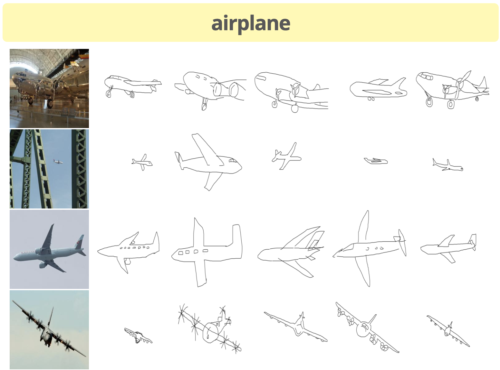
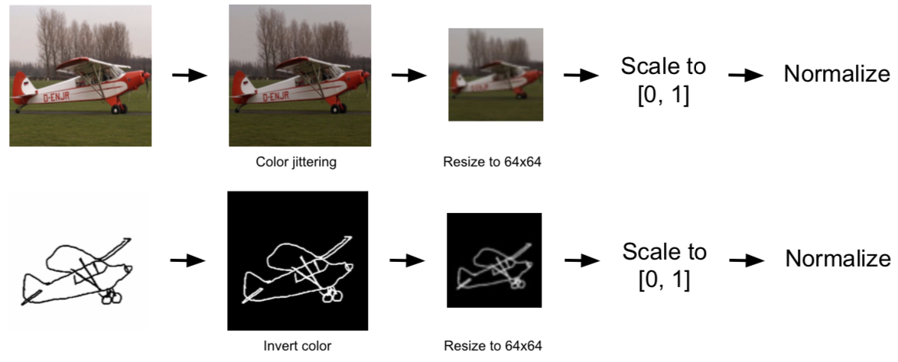

# Final Project: Sketch2Img
##### CS 182: Neural Networks, Spring 2019
##### Authors: David Wang, Danny Kim, Eamonn Carson, Kyle Kovach

$$
\newcommand{\given}[1][]{\:#1\vert\:}
\newcommand{\Prob}[1]{\mathbb{P}\left( #1 \right)}
\newcommand{\Var}{\mathrm{Var}}
\newcommand{\Cov}{\mathrm{Cov}}
\newcommand{\Expect}[1]{\mathrm{E}\left[ #1 \right]}
\newcommand{\divides}[1]{\,\left\vert\, #1 \right.}
\newcommand{\Note}[1]{\textnormal{ #1 }}
\newcommand{\Naturals}{\mathbb{N}}
\newcommand{\Posints}{\mathbb{Z}_{\geq 0}}
\newcommand{\Reals}{\mathbb{R}}
\newcommand{\Rationals}{\mathbb{Q}}
\newcommand{\float}{\mathrm{float}}
\newcommand{\E}[1]{\times10^{#1}}
\newcommand{\abs}[1]{\left\lvert #1 \right\rvert}
\newcommand{\norm}[1]{\left\lVert #1 \right\rVert}
\newcommand{\bigO}[1]{\mathcal{O}\left( #1 \right)}
\newcommand{\suchthat}{\textnormal{ such that }}
\newcommand{\vspan}[1]{\textnormal{span}\left\{#1\right\}}
\newcommand{\domatrix}[1]{
    \begin{pmatrix} 
        #1 
    \end{pmatrix}
}
$$

# Problem Statement and Background
# Approach
## Dataset
For our dataset, we needed pairs of sketches to images, since we need the actual images as references for our GAN. While [Google’s Quick, Draw! Dataset](https://github.com/googlecreativelab/quickdraw-dataset) has over 50 million sketches, the players were sketching based on a category, not a reference photo. Therefore, this dataset is unsuitable for us.

We ended up using the same dataset as the SketchyGAN paper, which is the [Sketchy database](http://sketchy.eye.gatech.edu/). This dataset is smaller, with around 75,000 sketches for 12,500 photos and a total of 125 categories. However, it crucially has pairs of photos and sketches, which makes this dataset the best choice for our needs.

*Caption: Within each category, each photo has several sketches associated with it.*

Next, we need to clean up our database. The photos and sketches folders contain several subdirectories, each corresponding to a different augmentation. For the photos, we have 2 possible options:
- tx_000000000000: image is non-uniformly scaled to 256x256
- **tx_000100000000: image bounding box scaled to 256x256 with an additional +10% on each edge; note that due to position within the image, sometimes the object is not centered**

For the sketches, we have 6 possible options:
- tx_000000000000: sketch canvas is rendered to 256x256 such that it undergoes the same scaling as the paired photo
- tx_000100000000: sketch is centered and uniformly scaled such that its greatest dimension (x or y) fills 78% of the canvas (roughly the same as in Eitz 2012 sketch data set)
- **tx_000000000010: sketch is translated such that it is centered on the object bounding box**
- tx_000000000110: sketch is centered on bounding box and is uniformly scaled such that one dimension (x or y; whichever requires the least amount of scaling) fits within the bounding box
- tx_000000001010: sketch is centered on bounding box and is uniformly scaled such that one dimension (x or y; whichever requires the most amount of scaling) fits within the bounding box
- tx_000000001110: sketch is centered on bounding box and is non-uniformly scaled such that it completely fits within the bounding box

We ultimately decided to go with the bolded options above, since these best preserved the original aspect ratio of the photos and sketches. Furthermore, since the augmentations used the object bounding box, the images did not have as much extraneous detail in the background or sides of the image.
Furthermore, the Sketchy database provides additional info and annotations, which specify the validity of the sketches. There are four different types of "incorrect" sketches:
- Error - Something is very wrong with the sketch. It may be completely incorrect and/or a squiggle.
- Ambiguous - The reviewer deemed the sketch too poor quality to identify as the subject object. However, these sketches may still approximate the correct shape and/or pose.
- Pose - The reviewer deemed the sketch identifiable, but not in a correct pose or perspective.
- Context - The artist included environmental details that were not part of the subject object, such as 'water ripples' around a duck.
We removed erroneous sketches, since they have no value and would actively hurt the training process of the GAN. However, we decided to keep the other types of "incorrect" sketches, since we don't think they are egregious enough to harm training.

## Image Processing

*Caption: Overview of how we process our photos (top) and sketches (bottom)*

Before feeding our photos and sketches into our GAN, we need to process them properly. For photos, we perform color jittering, which varies the brightness and contrast of the image randomly. For sketches, we invert the colors so that the lines of the sketch are white instead of black, since deep networks prefer areas of importance to have high values.

For both photos and sketches, we resize them from 256x256 to 64x64. This reduces the training time and computation load when training, and it allows to make our output images 64x64 as well, since we are using an architecture similar to a U-Net. We also scale the values down from $$[0, 255]$$ to $$[0, 1]$$, before normalizing to $$[-1, 1]$$.

Our normalization technique is a bit unconventional. We still center the photos and sketches around the mean. However, we don’t divide by the standard deviation, since this may cause values to go outside the $$[-1, 1]$$ range. Instead, we calculate the minimum and maximum values in the dataset as $$\min{data}$$ and $$\max{data}$$. We then calculate $$s = \max(\abs{\min{data}}, \abs{\max{data}})$$, and divide the dataset by $$s$$ instead.

## MRU
The MRU (Masked Residual Unit) is the core block of our network. This allows a convolutional network to be repeatedly conditioned on an input image. MRU uses learnable internal masks to extract new features selectively from the input image and combine with the feature maps which are computed in the previous layer. This is similar to attention processes since the MRU can select which regions of the input image to focus on.
The above figure shows the structure of MRU. It takes a feature map $$x$$ and an image $$I$$ as inputs, and outputs a feature map $$y$$. The input feature map $$x$$ is either the output from the previous layer or initial input to the network (which is a class label embedded into an image; the embedding is learned). In the generator image $$I$$ is the sketch (so that the generator can reference the sketch while it generates an image). In the discriminator the image $$I$$ is the sketch concatenated with the input image (so that the discriminator can reference the sketch and input image while deciding if the input image is fake).
The feature map $$x$$ has dimensions $$(c_x \times h \times w)$$, the image $$I$$ has dimensions $$(c_i \times h \times w)$$, and the output feature map $$y$$ has the dimensions $$(f_d \times h \times w)$$.
Before introducing the equations, let’s define few notations we are going to use:
- $$a \odot b$$ is concatenation of $$a$$ and $$b$$ along the channel axis
- $$\otimes$$ is element-wise multiplication
- $$\sigma$$ is the sigmoid function
- $$f$$ is the activation function
- $$\textrm{Conv}_d$$ is a 3x3 convolutional layer where the number of output channels is $$d$$
- $$1-$$ is element-wise subtraction from $$1$$ (i.e. $$1 - x$$)

First, in order to let MRU decide how much information it wants to preserve from the feature map $$x$$ upon receiving the new image, we creates a mask $$m = \sigma(\textrm{Conv}_{c_x}(x \odot I))$$. We apply this mask to the input feature map $$x$$, concatenate with the image $$I$$.  Then, we apply a convolutional layer and the activation function to get a new feature map: $$z = f(\textrm{Conv}_{f_d}((m \otimes x) \odot I))$$.
Since we want to dynamically combine the information from the feature map $$z$$ and the original input feature map $$x$$, we create a weight matrix: $$n = \sigma(\textrm{Conv}_{f_d}(x \odot I))$$ to perform a weighted combination of them: $$y = (1-n) \cdot \textrm{Conv}_{f_d}(x) + n \cdot z$$.
After each 3x3 convolutional layer, normalizations can be applied. For example, in the generator, the conditional batch normalization is applied after the convolutional layers in $$z$$ and $$y$$ (non-mask layers). In the discriminator, spectral normalization is applied after all convolutional layers and batch normalization is applied after the convolutional layers in $$z$$ and $$y$$ again for non-mask layers.
The equations can be summarized as below:
$$
\begin{align*}
m &= \sigma(\textrm{Conv}_{c_x}(x \odot I)) \\
n &= \sigma(\textrm{Conv}_{f_d}(x \odot I)) \\
z &= f(\textrm{Conv}_{f_d}((m \otimes x) \odot  I])) \\
y &= (1-n) \cdot \textrm{Conv}_{f_d}(x) + n \cdot z \\
\end{align*}
$$

$$ L(D) = L_{GAN}(D, G) + L_{AC}(D) $$

$$ L(G) = L_{GAN}(G) - L_{AC}(G) + L_{sup}(G) + L_{p}(G) + L_{div}(G) $$
        
$$ L_{GAN}(D, G) = \mathrm{E}_{Y \sim P_{image}}\left[ \log D(y) \right] + \mathrm{E}_{Y \sim P_{sketch}},\, z \sim P_z\left[ \log (1 - D(G(x,z)) \right] $$

$$ L_{AC} = \Expect{\log P\left(C = c \given y \right) $$

$$ L_{sup} = \norm{G(x, z) - y_1 $$

$$ L_{p} = \sum_{i} \lambda_p \norm{\phi_i\left( G(x,z) \right) - \phi_i\left( y \right)_1 $$

$$ L_{div} = -\lambda_{div} \norm{G(x, z_1) - G(x, z_2)_1 $$
