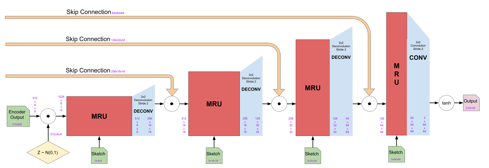

# Final Project: Sketch2Img
##### CS 182: Neural Networks, Spring 2019
##### Authors: David Wang, Dongsub Kim, Eamonn Carson, Kyle Kovach

$$
\newcommand{\given}[1][]{\:#1\vert\:}
\newcommand{\Prob}[1]{\mathbb{P}\left( #1 \right)}
\newcommand{\Var}{\mathrm{Var}}
\newcommand{\Cov}{\mathrm{Cov}}
\newcommand{\Expect}[1]{\mathrm{E}\left[ #1 \right]}
\newcommand{\divides}[1]{\,\left\vert\, #1 \right.}
\newcommand{\Note}[1]{\textnormal{ #1 }}
\newcommand{\Naturals}{\mathbb{N}}
\newcommand{\Posints}{\mathbb{Z}_{\geq 0}}
\newcommand{\Reals}{\mathbb{R}}
\newcommand{\Rationals}{\mathbb{Q}}
\newcommand{\float}{\mathrm{float}}
\newcommand{\E}[1]{\times10^{#1}}
\newcommand{\abs}[1]{\left\lvert #1 \right\rvert}
\newcommand{\norm}[1]{\left\lVert #1 \right\rVert}
\newcommand{\bigO}[1]{\mathcal{O}\left( #1 \right)}
\newcommand{\suchthat}{\textnormal{ such that }}
\newcommand{\vspan}[1]{\textnormal{span}\left\{#1\right\}}
\newcommand{\domatrix}[1]{
    \begin{pmatrix} 
        #1 
    \end{pmatrix}
}
$$

# Abstract

The motivation of Sketch2Img is to accelerate prototyping and creation of original art assets by turning low effort drawings into realistic photographs. Sketch2Img utilizes a generative adversarial network (GAN) in order to generate realistic images from input sketches. The architecture largely follows the SketchyGAN paper, but we bolster the discriminator by providing it with the input sketches, in addition to the real and fake images. Although we were not able to create photo-realistic images, some of the ones we created are somewhat recognizable as blurry photos of classes they represent.

# Problem Statement and Background
Since the goal of Sketch2img is to allow artists to go from crude sketches to realistic images quickly and with minimal effort, the sketches used for training of the network reflect this: they are line drawings that mostly show the outlines of objects rather than the details that we wish to be present in the final images produced. 

Our plan was to assess the quality of our model by inspecting the images it produces on our own--after all, if the goal is to produce images that trick humans into believing they were taken with a camera, a human-centric approach to determine its effectiveness would be best. 

If the images produced by our model could be realistic enough, it could be used by artists looking to save time or effort, and open up whole new avenues of prototyping paths for designers. Imagine being able to go from a new visual idea to an image of what that idea would look like in real life, by simply sketching it out and uploading it to our model. This could enable people to perfect their concepts much quicker, removing the bottleneck of the entire prototyping process. 

what that idea would look like in real life, by simply sketching it out and uploading it to our model. This could enable people to perfect their concepts much quicker, removing the bottleneck of the entire prototyping process. 

# Approach
## Dataset
For our dataset, we needed pairs of sketches to images, since we need the actual images as references for our GAN. While [Google’s Quick, Draw! Dataset](https://github.com/googlecreativelab/quickdraw-dataset) has over 50 million sketches, the players were sketching based on a category, not a reference photo. Therefore, this dataset is unsuitable for us.

We ended up using the same dataset as the SketchyGAN paper, which is the [Sketchy database](http://sketchy.eye.gatech.edu/). This dataset is smaller, with around 75,000 sketches for 12,500 photos and a total of 125 categories. However, it crucially has pairs of photos and sketches, which makes this dataset the best choice for our needs.

*Caption: Within each category, each photo has several sketches associated with it.*

Next, we need to clean up our database. The photos and sketches folders contain several subdirectories, each corresponding to a different augmentation. For the photos, we have 2 possible options:
- tx_000000000000: image is non-uniformly scaled to 256x256
- **tx_000100000000: image bounding box scaled to 256x256 with an additional +10% on each edge; note that due to position within the image, sometimes the object is not centered**

For the sketches, we have 6 possible options:
- tx_000000000000: sketch canvas is rendered to 256x256 such that it undergoes the same scaling as the paired photo
- tx_000100000000: sketch is centered and uniformly scaled such that its greatest dimension (x or y) fills 78% of the canvas (roughly the same as in Eitz 2012 sketch data set)
- **tx_000000000010: sketch is translated such that it is centered on the object bounding box**
- tx_000000000110: sketch is centered on bounding box and is uniformly scaled such that one dimension (x or y; whichever requires the least amount of scaling) fits within the bounding box
- tx_000000001010: sketch is centered on bounding box and is uniformly scaled such that one dimension (x or y; whichever requires the most amount of scaling) fits within the bounding box
- tx_000000001110: sketch is centered on bounding box and is non-uniformly scaled such that it completely fits within the bounding box

We ultimately decided to go with the bolded options above, since these best preserved the original aspect ratio of the photos and sketches. Furthermore, since the augmentations used the object bounding box, the images did not have as much extraneous detail in the background or sides of the image.

Furthermore, the Sketchy database provides additional info and annotations, which specify the validity of the sketches. There are four different types of "incorrect" sketches:
- Error - Something is very wrong with the sketch. It may be completely incorrect and/or a squiggle.
- Ambiguous - The reviewer deemed the sketch too poor quality to identify as the subject object. However, these sketches may still approximate the correct shape and/or pose.
- Pose - The reviewer deemed the sketch identifiable, but not in a correct pose or perspective.
- Context - The artist included environmental details that were not part of the subject object, such as 'water ripples' around a duck.

We removed erroneous sketches, since they have no value and would actively hurt the training process of the GAN. However, we decided to keep the other types of "incorrect" sketches, since we don't think they are egregious enough to harm training.

## Image Processing

*Caption: Overview of how we process our photos (top) and sketches (bottom)*

Before feeding our photos and sketches into our GAN, we need to process them properly. For photos, we perform color jittering, which varies the brightness and contrast of the image randomly. For sketches, we invert the colors so that the lines of the sketch are white instead of black, since deep networks prefer areas of importance to have high values.

For both photos and sketches, we resize them from 256x256 to 64x64. This reduces the training time and computation load when training, and it allows to make our output images 64x64 as well, since we are using an architecture similar to a U-Net. We also scale the values down from $$[0, 255]$$ to $$[0, 1]$$, before normalizing to $$[-1, 1]$$.

Our normalization technique is a bit unconventional. We still center the photos and sketches around the mean. However, we don’t divide by the standard deviation, since this may cause values to go outside the $$[-1, 1]$$ range. Instead, we calculate the minimum and maximum values in the dataset as $$\min{data}$$ and $$\max{data}$$. We then calculate $$s = \max(\abs{\min{data}}, \abs{\max{data}})$$, and divide the dataset by $$s$$ instead.

## MRU

The MRU (Masked Residual Unit) is the core block of our network. This allows a convolutional network to be repeatedly conditioned on an input image. MRU uses learnable internal masks to extract new features selectively from the input image and combine with the feature maps which are computed in the previous layer. This is similar to attention processes since the MRU can select which regions of the input image to focus on.

The above figure shows the structure of MRU. It takes a feature map $$x$$ and an image $$I$$ as inputs, and outputs a feature map $$y$$. The input feature map $$x$$ is either the output from the previous layer or initial input to the network (which is a class label embedded into an image; the embedding is learned). In the generator image $$I$$ is the sketch (so that the generator can reference the sketch while it generates an image). In the discriminator the image $$I$$ is the sketch concatenated with the input image (so that the discriminator can reference the sketch and input image while deciding if the input image is fake).

The feature map $$x$$ has dimensions $$(c_x \times h \times w)$$, the image $$I$$ has dimensions $$(c_i \times h \times w)$$, and the output feature map $$y$$ has the dimensions $$(f_d \times h \times w)$$.

Before introducing the equations, let’s define few notations we are going to use:
- $$a \odot b$$ is concatenation of $$a$$ and $$b$$ along the channel axis
- $$\otimes$$ is element-wise multiplication
- $$\sigma$$ is the sigmoid function
- $$f$$ is the activation function
- $$\textrm{Conv}_d$$ is a 3x3 convolutional layer where the number of output channels is $$d$$
- $$1-$$ is element-wise subtraction from $$1$$ (i.e. $$1 - x$$)

First, in order to let MRU decide how much information it wants to preserve from the feature map $$x$$ upon receiving the new image, we creates a mask $$m = \sigma(\textrm{Conv}_{c_x}(x \odot I))$$. We apply this mask to the input feature map $$x$$, concatenate with the image $$I$$.  Then, we apply a convolutional layer and the activation function to get a new feature map: $$z = f(\textrm{Conv}_{f_d}((m \otimes x) \odot I))$$.

Since we want to dynamically combine the information from the feature map $$z$$ and the original input feature map $$x$$, we create a weight matrix: $$n = \sigma(\textrm{Conv}_{f_d}(x \odot I))$$ to perform a weighted combination of them: $$y = (1-n) \otimes \textrm{Conv}_{f_d}(x) + n \otimes z$$.

After each 3x3 convolutional layer, normalizations can be applied. For example, in the generator, the conditional batch normalization is applied after the convolutional layers in $$z$$ and $$y$$ (non-mask layers). In the discriminator, spectral normalization is applied after all convolutional layers and batch normalization is applied after the convolutional layers in $$z$$ and $$y$$ again for non-mask layers.
The equations can be summarized as below:

$$
\begin{align*}
m &= \sigma(\textrm{Conv}_{c_x}(x \odot I)) \\
n &= \sigma(\textrm{Conv}_{f_d}(x \odot I)) \\
z &= f(\textrm{Conv}_{f_d}((m \otimes x) \odot  I)) \\
y &= (1-n) \otimes \textrm{Conv}_{f_d}(x) + n \otimes z \\
\end{align*}
$$

## GAN

*Caption: Overall structure of the network*

## Generator
The generator uses an encoder-decoder structure. Both the encoder and the decoder are built with 4 MRU blocks each followed by either a convolutional layer or a deconvolutional layer. The generator takes an integer class label and a sketch. The label is then embedded (with a learned embedding) to have dimensions of 1x64x64. The sketches are resized to the proper dimensions and fed into every MRU block in the generator.

Also, there are skip-connections between the encoder and decoder blocks. The output feature maps from the MRU of the encoder block are concatenated (along the channel dimension) to the output of the corresponding decoder block after the deconvolutional layer

*Caption: architecture of the generator's encoder block*

In the encoder block, the MRU doubles the channel dimensions while keeping the height and width dimensions of the feature maps and the convolutional layer halves the height and width dimensions while keeping the channel dimension.

*Caption: architecture of the generator's decoder block*

Note that between the encoder and the decoder, noise is concatenated to the output of the encoder in order to encourage diversity between generated images.

In the decoder block, both the MRU and the deconvolutional layers halve the channel dimensions. The MRU keeps the dimensions of height and width while the deconvolutional layer doubles them. Note that the skip-connections cause the outputs of the corresponding encoder block to be concatenated to the output from the deconvolution layer. Finally, after the last MRU, instead of a deconvolution, a convolutional layer is applied to reduce the channel dimension to 3. Then, element-wise $$\tanh$$ function is applied to convert the range $$[-1, 1]$$.

## Discriminator 

*Caption: architecture of the discriminator*

The discriminator has the same structure as the encoder from the generator. The discriminator takes one input which is a concatenated image of a real or fake image and a corresponding sketch.

By feeding the concatenated image to the discriminator instead of just the image, the discriminator can use the information from the sketch to figure out the realism of the input image.

The encoder of the generator uses a label as its initial feature maps. However, in the discriminator, it uses the input image as initial feature maps.

The discriminator adds two fully connected layers at the end which take outputs feature maps from the final MRU. The first fully connected layer outputs one logit that is the probability of the input image is real. The second fully connected layer outputs the logits for the classification of the input image.

## Explanation of Losses
Let $$x$$ be the sketch, $$y$$ be the corresponding real image, $$z$$ be a noise, and $$c$$ be a class label. 

Our first loss function is the generic GAN loss (which is binary cross entropy loss for the discriminator’s classification of images as real or fake):

$$ L_\textrm{GAN}(D, G) = \mathrm{E}_{Y \sim P_{image}}\left[ \log D(y) \right] + \mathrm{E}_{Y \sim P_{sketch},\, z \sim P_z}\left[ \log (1 - D(G(x,z)) \right] $$

This loss incentivizes the discriminator to correctly classify real images as being real, and fake images as being fake. Alternatively, the objective of generator is to maximize the the second term (i.e. to fool the discriminator). When we are using it to optimize the generator we use the notation LGAN(G) to emphasize that the discriminator is held constant.

The second loss function is an auxiliary classification loss (which is cross entropy loss for the discriminator’s classification of the content of an image: i.e. is this image of a cat or a dog?):

$$ L_\textrm{AC}(D) = \Expect{\log P\left(C = c \given y \right)} $$

This loss incentivizes the discriminator to correctly classify the subject of images, the hope being that this loss will incentivize the discriminator to learn important image features sooner. We also propagate this loss to the generator so that it is incentivized to produce images that are recognizably of a certain class. To clarify that we propagate to the generator, we denote this loss $$L_\textrm{AC}(G)$$ when it is applied to the generator.

The third loss function is DRAGAN loss $$L_\textrm{dragan}(D)$$, which is used to avoid mode collapse. For more details see [the DRAGAN paper](https://arxiv.org/abs/1705.07215). This loss applied to the discriminator as per the DRAGAN paper.

The fourth loss function is supervised loss (just a L1 distance between the generated and ground-truth images):

$$ L_\textrm{sup} = \norm{G(x, z) - y_1} $$

This loss simply motivates the generator to produce images that are pixel-by-pixel similar to the real ones. It is unwise to use this loss alone, since the L1 distance also measures the difference between backgrounds and other irrelevant parts of the image.

Our fifth loss function is a perceptual loss which measures the L1 distance between the generated and ground-truth image within the embedded space of the activations of the layers of the inception-v4 model:

$$ L_\textrm{p} = \sum_{i} \norm{\phi_i\left( G(x,z) \right) - \phi_i\left( y \right)_1 } $$

Where $$\phi_i(a)$$ is the layer activation of layer $$i$$ of the inception-v4 model when given the input $$a$$. This loss serves to measure the ‘perceptual’ difference between the content of the generated image and the content of the ground-truth image. Hence this loss encourages the generator to create images whose important features (determined by the inception-v4) match those of the ground-truth image.

The final loss we use is a diversity loss which computes the output of the generator for two different $$N(0, 1)$$ noise vectors $$z_1$$ and $$z_2$$, and computes the negative slope between them:

$$ L_\textrm{div} = - \norm{G(x, z_1) - G(x, z_2)_1 } $$

The purpose of this loss is to encourage the generator to have high diversity in its output images (and it does so by rewarding the generator for having a high local rate of change).

Furthermore, to each of these losses we multiply hyperparameters/weights. For our most successful run, we kept all weights at 1 except for the DRAGAN loss, where we used a weight of 10 and an internal hyperparameter $$k = 1$$ (see [the tensorflow implementation of DRAGAN](https://github.com/kodalinaveen3/DRAGAN) for more details).

All in all the loss for the discriminator is

$$ L(D) = L_\textrm{GAN}(D, G) + L_\textrm{AC}(D) + 10 L_\textrm{dragan}(D)$$

And the loss for the generator is

$$ L(G) = L_\textrm{GAN}(G) - L_{AC}(G) + L_\textrm{sup}(G) + L_{p}(G) + L_\textrm{div}(G) $$

Both of these losses should be minimized.

## Results

Our first model was trained with a discriminator learning rate of 0.0002 and generator learning rate of 0.0001, with batch size 16. We used the entire dataset which contains 125 classes and 75,000 sketches. Training one epoch roughly takes 12 hours on Google Colab with a GPU.

The model seems to improve over the first epoch. The generated images from the first epoch are shown below. It shows how the generator is improved from top-left to bottom-right.

It started with a pure noise, but gradually learned the structure of the sketch and distinguish the sketch from the background. However, it has grid-shape of noise and very blurry.

The losses of the generator and discriminator for the first epoch is shown below.

The accuracy graph of the discriminator for the real inputs is shown below. The discriminator tries to predict the input images’ class label out of 125 classes.

The classification accuracy improved a lot considering that it has to predict a class out of 125 classes.

However, after the first epoch, the generator starts to output black images regardless of the sketches it takes as shown below. Therefore, we stopped training this model and made changes.

First, we fixed a bug in the loss. We also used only 10 categories so that training was faster, and we switched from batch normalization to conditional batch normalization [4] in the generator. We trained with roughly the same learning rates for 20 epochs. Our images did not have the same problem of outputting black like the last model. However, the images generated were still pretty blurry, though some categories performed much better than others.

*Caption: Examples of the better categories with our modified model. These include armor (left), apple (middle left), alarm clock (middle right), and banana (right)*

*Caption: Examples of categories that didn’t perform so well. These include ant (left) and bear (right)*

We also tried another model where the generator takes in processed sketches instead of embedded labels. We converted the sketch to have 8 channel dimensions using an additional convolutional layer. This seemed to reduce the blurriness of the images a little bit, since some semblance of the sketch could be seen in the generated images.

*Caption: Example of some generated airplane images after feeding in sketches instead of labels to the generator.*

We also attempted some additional changes mentioned in [this article](https://medium.com/@utk.is.here/keep-calm-and-train-a-gan-pitfalls-and-tips-on-training-generative-adversarial-networks-edd529764aa9), such as flipping the labels and implementing soft and noisy labels. Unfortunately, we did not see significant improvement with these changes.

# Lessons Learned
One of the hardest lessons we learned is that GANs are very difficult to train. Our overall results could not reach the sharpness that the SketchyGAN paper was able to due to time constraints, and it is unlikely that our model will be able to produce images for our intended purpose of art asset creation. However, we were able to get the model to produce recognizable, though blurry, images for a few classes.

# Team Contributions
- Dongsub Kim : I implemented the code for the MRU block, generator class, discriminator class and overall training process on Google Colab. I made visualizations of images and losses for the poster. For the final blogpost, I wrote the MRU, generator, discriminator and results sections (25%)
- David Wang : I wrote the code to clean up, process, and load the dataset. I also wrote the majority of the code for the MRU unit, encoder, decoder, generator, and discriminator. For the poster, I contributed the MRU diagram and the dataset section. For the blog post, I wrote the dataset and image processing sections. (33%)
- Eamonn Carson : I implemented discriminator losses, created the overall network diagram (on poster/final-blogpost), wrote the explanation of losses (on final-blogpost), trained the GAN (on 25 classes), debugged the sign of losses for GAN training, and converted the final report to markdown and $$\LaTeX$$ (25%)
- Kyle Kovach : I implemented the code for the generator loss function, and implemented code for each term into its own method. I also wrote the explanations for each term of the loss functions on the project poster. For the final blog post, I wrote abstract, along with the problem statement and background sections.  (17%)

## References
1. Wengling Chen, James Hays. SketchyGAN: Towards Diverse and Realistic Sketch to Image Synthesis https://arxiv.org/abs/1801.02753
2. Jacob Abernethy, James Hays, Zsolt Kira. On Convergence and Stability of GANs, https://arxiv.org/abs/1705.07215
3. T. Salimans, I. Goodfellow, W. Zaremba, V. Cheung, A. Radford, and X. Chen. Improved techniques for training gans. In Advances in Neural Information Processing Systems, pages 2234–2242, 2016.
4. V. Dumoulin, J. Shlens, and M. Kudlur. A learned representation for artistic style. ICLR, 2017. 
https://arxiv.org/pdf/1610.07629.pdf

